# Rust thoughts

## 1.Cargo.toml和Cargo.lock

你首次构建一个项目的时候，Cargo会输出一个Cargo.lock文件，里面记录了每个库使用的精确的版本。之后构建的时候会直接读取该文件并使用里面的版本。

Cargo只有在你希望它更新的时候才会更新新版本，手动修改Cargo.toml里的版本成新的版本号或者运行cargo update。

cargo update命令仅仅更新最新的兼容版本，如果你想跨不兼容的版本更新，需要手动修改Cargo.toml，下次构建的时候，Cargo会更新版本和Cargo.lock文件。

指定的版本为git仓库的场景，cargo build命令在有Cargo.lock文件的时候不会再拉仓库的最新代码，它会用Cargo.lock里面记录的版本，但是cargo update会拉最新的代码。

Cargo.lock文件是自动生成的，你不应该手动修改它。假如你的项目是一个可执行文件，你应该把Cargo.lock文件提交到代码库，这样，其他人下载构建的时候会使用相同的版本，确保构建后的二进制相同。Cargo.lock文件的修改历史记录了依赖的更新。

假如你的工程是一个普通的库，你不应该把Cargo.lock提交到代码库。你的库的使用者有自己的Cargo.lock文件，它们会忽略你库里的Cargo.lock文件。

假如你的工程是个动态库工程，不会有使用者用到你的源代码，这时也应该提交Cargo.lock文件到代码库。

## 2.引用

>   原文标题: References in Rust
>   原文链接: https://blog.thoughtram.io/references-in-rust/

如果你已经读过我们的文章[Rust’s Ownership](https://link.zhihu.com/?target=https%3A//blog.thoughtram.io/ownership-in-rust/)或者如果你已经写过一些程序并且想知道[what’s the difference between String and &str](https://link.zhihu.com/?target=https%3A//blog.thoughtram.io/string-vs-str-in-rust)，你就应该知道Rust中有个引用的概念。

### 什么是引用？(What are references again?)

引用是对内存中的另一个值的非拥有(nonowning)指针类型。引用可以使用借用操作符`&`来创建，所以下面的代码创建了一个变量`x`使其拥有值`10`和一个变量`r`使其引用`x`:

```rust
let x = 10;
let r = &x;
```

因为10是一个原始类型(primitive type)，所以它和引用都存储在栈上。这里是它们在内存中大概的样子（如果你不理解堆和栈这两个术语，你可能需要看一下关于Rust所有权的[那篇文章](https://link.zhihu.com/?target=https%3A//blog.thoughtram.io/ownership-in-rust)）。

```text
				   +–––––––+
                   │       │
            +–––+––V–+–––+–│–+–––+
stack frame │   │ 10 │   │ • │   │ 
            +–––+––––+–––+–––+–––+
                [––––]   [–––]
                  x        r
```

引用可以指向内存中任何地方的值，不仅仅是栈上的。例如下面的代码，创建了一个之前在[ String vs &str in Rust](https://link.zhihu.com/?target=https%3A//blog.thoughtram.io/string-vs-str-in-rust)中讨论过的字符串切片引用(string slice reference)。

```rust
let my_name = "Pascal Precht".to_string();

let last_name = &my_name[7..];
```

`String`是一个指向存储在堆上的数据的指针类型。**字符串切片(string slice)是数据上子串的引用**，因此它也是指向堆上的内存。

```text
				my_name       last_name
            [––––––––––––]    [–––––––]
            +–––+––––+––––+–––+–––+–––+
stack frame │ • │ 16 │ 13 │   │ • │ 6 │ 
            +–│–+––––+––––+–––+–│–+–––+
              │                 │
              │                 +–––––––––+
              │                           │
              │                           │
              │                         [–│––––––– str –––––––––]
            +–V–+–––+–––+–––+–––+–––+–––+–V–+–––+–––+–––+–––+–––+–––+–––+–––+
       heap │ P │ a │ s │ c │ a │ l │   │ P │ r │ e │ c │ h │ t │   │   │   │
            +–––+–––+–––+–––+–––+–––+–––+–––+–––+–––+–––+–––+–––+–––+–––+–––+
```

关于字符串，我们还可以创建预分配只读内存的字符串字面量(string literals)。例如下面代码中的`name`就是一个`str`的引用，`str`是存放在程序的预分配内存中的。

```rust
let name = "Pascal";
```

上面的代码看起来像下面这样:

```text
			name: &str
            [–––––––]
            +–––+–––+
stack frame │ • │ 6 │ 
            +–│–+–––+
              │                 
              +––+                
                 │
 preallocated  +–V–+–––+–––+–––+–––+–––+
 read-only     │ P │ a │ s │ c │ a │ l │
 memory        +–––+–––+–––+–––+–––+–––+
```

关于引用还有什么要讲的呢？还有一些。让我们从共享引用(shared references)和可变引用(mutable reference)开始。

### 共享引用和可变引用 (Shared and mutable references)

或许你已经知道，Rust中的变量默认是不可变的。引用也是如此。例如我们有一个`struct Person`并且尝试编译下面的代码:

```rust
struct Person {
  first_name: String,
  last_name: String,
  age: u8
}

let p = Person {
  first_name: "Pascal".to_string(),
  last_name: "Precht".to_string(),
  age: 28
};

let r = &p;

r.age = 29;
```

这会导致一个编译错误:

```text
error[E0594]: cannot assign to `r.age` which is behind a `&` reference
  --> src/main.rs:16:3
   |
14 |   let r = &p;
   |           -- help: consider changing this to be a mutable reference: `&mut p`
15 |   
16 |   r.age = 29;
   |   ^^^^^^^^^^ `r` is a `&` reference, so the data it refers to cannot be written
```

你可以在[这里](https://link.zhihu.com/?target=https%3A//play.rust-lang.org/%3Fversion%3Dstable%26mode%3Ddebug%26edition%3D2018%26gist%3D3a40de737f8c6d47284fe3e91b04598b)进行运行。Rust关于这个问题的处理十分清晰并且它告诉我们可以使用关键字`mut`来使`&p`可变。这对于`r`和`p`也是一样的。但是，这样就引入了另外一个特性，即每次只能有一个可变引用。

```rust
let mut r = &mut p;
let mut r2 = &mut p;
```

上面的代码试图对同一份数据创建两个可变引用。如果我们想要编译这份代码，Rust会报出下面的错误：

```text
error[E0499]: cannot borrow `p` as mutable more than once at a time
  --> src/main.rs:15:16
   |
14 |   let mut r = &mut p;
   |               ------ first mutable borrow occurs here
15 |   let mut r2 = &mut p;
   |                ^^^^^^ second mutable borrow occurs here
16 |   
17 |   r.age = 29;
   |   ---------- first borrow later used here
```

虽然这看上去出乎意料，但是却十分合理。Rust声称是内存安全的，而不能对同一份数据进行多个可变引用便是保证内存安全的条件之一。如果在代码的不同地方存在着多个这样的可变引用，就无法保证它们的其中之一不会以不可预期的方式修改数据。

另一方面，同一份数据有多个共享引用也是有必要的。所以假定`p`和`r`都是不可变的，下面这样做就没有问题:

```rust
let r = &p;
let r2 = &p;
let r3 = &p;
let r4 = &p;
let r5 = &p;
```

对引用进行引用也是有可能的:

```rust
let r = &p;
let rr = &r; // &&p
let rrr = &rr; // &&&p
let rrrr = &rrr; // &&&&p
let rrrrr = &rrrrr; // &&&&&p
```

但是，等等。。。这样符合实际吗？如果我们给一个函数传递一个`r5`，而实际上是一个`&&&&&p`，那个函数将会以什么样的方式接收一个引用的引用的引用的引用的...来工作呢？显然，引用可以被解引用。

### 解引用 (Dereferencing References)

引用可以使用`*`操作符来进行解引用从而获取其在内存中指向的值。如果我们使用前面的代码片段，即`x`拥有值`10`并且`r`引用`x`， 就可以用下面的方式解引用从而进行比较:

```rust
let x = 10;
let r = &x;

if *r == 10 {
  println!("Same!");
}
```

但是，让我们看看一个稍微不同的代码:

```rust
fn main() {
  let x = 10;
  let r = &x;
  let rr = &r; // `rr` is a `&&x`

  if is_ten(rr) {
    println!("Same!");
  }
}

fn is_ten(val: &i32) -> bool {
  *val == 10
}
```

`is_ten()`接收一个`&i32`或者说一个32位有符号整数的引用。尽管实际上我们传递给它的是一个`&&i32`，或者说是一个32位有符号整数的引用的引用。

所以要想让它能够正确运行，似乎`val:&i32`实际上应该是`val:&&i32`，表达式`*val==10`应该是`**val==10`。事实上，如果把代码按照刚刚那样修改确实可以按照预期结果运行。你可以在[这里](https://link.zhihu.com/?target=https%3A//play.rust-lang.org/%3Fversion%3Dstable%26mode%3Ddebug%26edition%3D2018%26gist%3Df03305d9cf51f3d242e989eab4b84019)试试。但是，即使我们没有修改，代码仍然可以正常编译，这里发生了什么？

Rust的比较操作符(例如`==`和`>=`等)是相当智能的，因此只要操作符两边的类型一样，它们可以跟踪一系列的引用直到它们可以找到一个值。这意味着在实际引用中，你可以按照需要进行很多重引用，对于编译器来讲，这些语法开销(syntactical cost)是一样的，因为编译器会替你辨别的。

### 隐式解引用和借用(Implicit dereferencing and borrowing)

此时，你可能想知道，为什么我在具体的类型上调用方法时不需要使用`*`操作符？要想说明这个问题，让我们先来看看之前定义的`Person`结构体:

```rust
struct Person {
  first_name: String,
  last_name: String,
  age: u8
}

fn main() {
  let pascal = Person {
    first_name: "Pascal".to_string(),
    last_name: "Precht".to_string(),
    age: 28
  };

  let r = &pascal;

  println!("Hello, {}!", r.first_name);
}
```

你应该注意到了，即使我们使用的是一个引用，但是我们没有使用`*`操作符也能获取引用`r`里的`first_name`字段。这里我们看到的是Rust编译期的另一个可用性特性(usability feature )。即`.`操作符会在需要的时候，进行**隐式的解引用**。

如果没有这个特性的话，可能需要像下面这样写：

```rust
println!("Hello, {}!", (*r).first_name);
```

这也同样适用于借用引用和可变引用。例如，一个数组的`sort()`方法需要一个`&mut self`。但是，当我们像下面这样写时也不需要担心:

```rust
fn main() {
  let mut numbers = [3, 1, 2];
  numbers.sort();
}
```

`.`操作符会隐式地对左边的操作符借用一个引用。这意味着，`.sort()`调用等价于下面的代码：

```rust
(&mut numbers).sort();
```

多么酷!

# 3.Rust模块系统

>   Cargo 遵循的一个约定：src/main.rs 就是一个与包同名的二进制 crate 的 crate 根。同样的，Cargo 知道如果包目录中包含 src/lib.rs，则包带有与其同名的库 crate，且 src/lib.rs 是 crate 根。
>   如果一个包同时含有 src/main.rs 和 src/lib.rs，则它有两个 crate：一个库和一个二进制项，且名字都与包相同。

看到后我就很快啊，去试了一下，然后就懵了，有些模块系统的规则似乎并不适用于此。

经过一阵探索后，总结规则如下：

-   **crate关键字在不同crate中含义不同。**

在库crate中，代表的是lib.rs；在二进制crate中，代表的是main.rs。

-   **使用自己的crate名代表的是其库crate**

假设crate名为*xxtest*，那么*xxtest::name()*也就是在调用库crate中的函数name。

值得一提的是，自己的crate名在只有在main.rs和lib.rs同时存在的时候才会赋予特殊的含义，并只在二进制crate中可用；

值得二提的是，当存在一个和crate名同名的模块时，会优先调用模块里的东西。

顺带提一嘴，使用mod lib并不能变为一个普通模块，但是你可以使用crate::lib来访问模块了，虽然我并不建议你这么用。

# 4.Use关键字的习惯用法

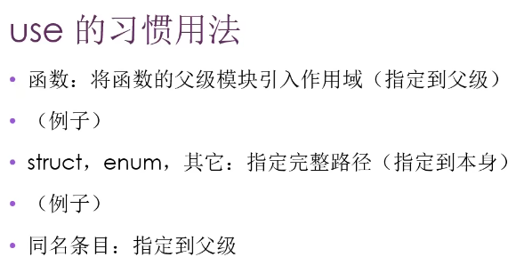

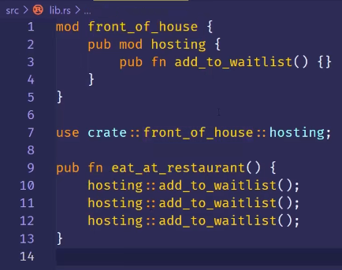

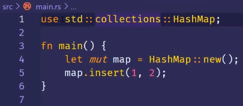

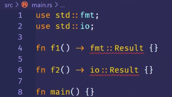

用as起个别名

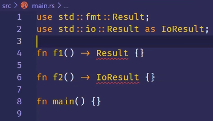

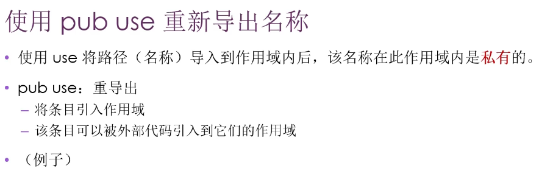


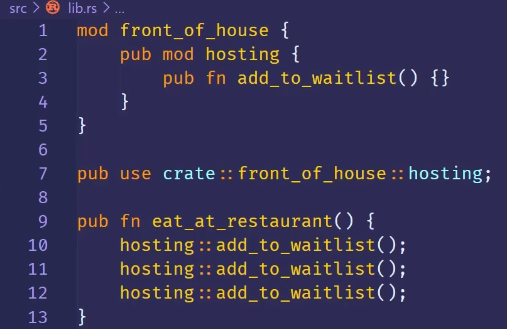

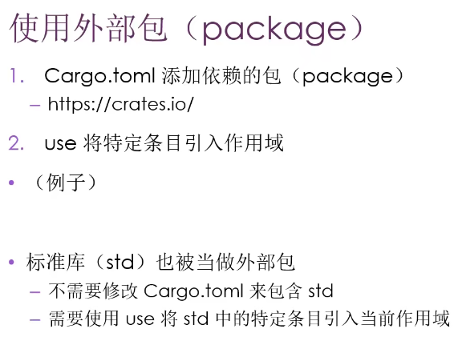

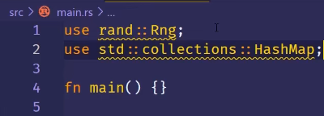

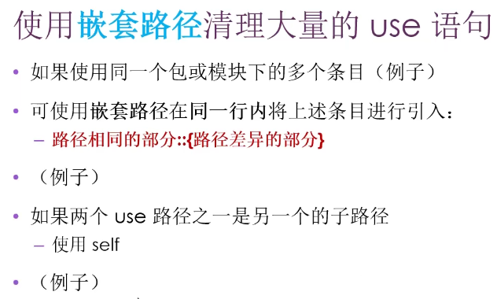

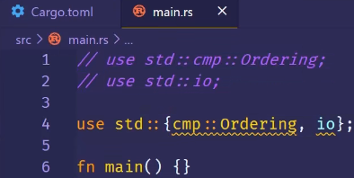

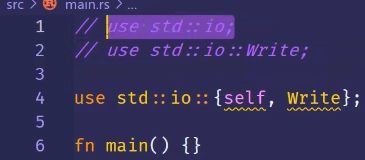


